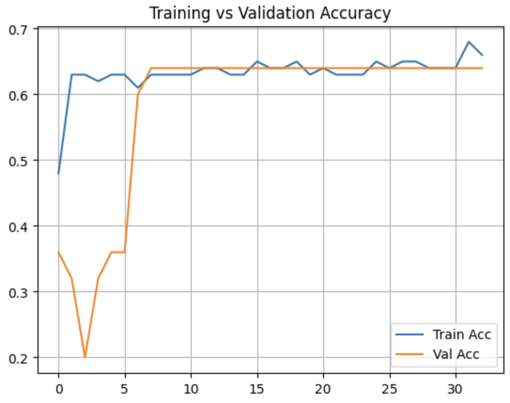

# 🧠 NVDA LSTM Predictor

A deep learning model that predicts **whether NVIDIA's stock (NVDA) will go UP or DOWN next week** based on historical data and technical indicators - using an LSTM (Long Short-Term Memory) neural network trained on normalized weekly price patterns.

---

## 📂 Folder Structure

```
NVDA-LSTM-PREDICTOR/
│
├── assets/
│   ├── split_not_taken_into_account.png
│   ├── split_taken_into_account.png
│   └── training_vs_validation_accuracy.png
│
├── NVDA_LSTM_Predictor.ipynb    # Jupyter Notebook with all code
├── requirements.txt             # Python dependencies
├── .env                         # Alpaca API keys (not committed)
├── README.md                    # Project documentation
├── .gitignore
└── venv/                        # Virtual environment (excluded from Git)
```

---

## 🚀 Project Summary

We trained a neural network to predict whether the **next week's closing price of NVDA stock will be higher than this week's**, using:

- Weekly historical stock data from **Alpaca API**
- Technical indicators: **MACD**, **RSI**, **SMAs**
- Preprocessing: **stock split adjustment**, **normalization**, **sequence generation**
- A custom **LSTM model** trained with `binary_crossentropy` loss

---

## 📈 Why Predict Weekly Direction?

Because the stock market is noisy and volatile daily, we shift our perspective to **weekly resolution**, making it more reliable for trend-based strategies.

---

## 📊 Indicators Used

| Indicator       | Purpose                                                                   |
| --------------- | ------------------------------------------------------------------------- |
| **MACD**        | Measures momentum. Positive MACD = uptrend; crossovers give trade signals |
| **MACD Signal** | 9-period EMA of MACD - smoother signal line                               |
| **RSI**         | Detects overbought (>70) and oversold (<30) conditions                    |
| **SMA5/20/50**  | Simple Moving Averages that indicate short- and long-term price trends    |
| **Close Price** | The final price for the week - our main reference                         |

All indicators are calculated using the [`ta`](https://github.com/bukosabino/ta) library.

---

## ✂️ Why Normalize for Stock Splits?

In **June 2024**, NVDA had a **10:1 stock split**. Without adjusting historical data, the model would learn garbage signals.

**Visual comparison:**

| Adjusted for Split ✅                            | Not Adjusted ❌                                          |
| ------------------------------------------------ | -------------------------------------------------------- |
|  |  |

We used a custom `adjust_for_stock_split()` function to scale historical prices and volumes appropriately.

---

## 🤖 Why LSTM?

**LSTMs (Long Short-Term Memory networks)** are specialized RNNs designed for **sequence prediction**. They remember patterns across time - perfect for stock price time series.

### How we used it:

- Input: Past **10 weeks** of technical indicators
- Output: A **binary prediction** for next week: `1` (UP) or `0` (DOWN)
- Architecture:
  - 2 stacked LSTM layers (64 units each)
  - Dropout + L2 regularization to prevent overfitting
  - Dense sigmoid output layer

---

## 📊 Training Results



```
Train accuracy: 65.00%
Test accuracy: 64.00%
Validation Gap: 1.00%
```

The model generalizes well and performs significantly better than random guessing (50%).

---

## 🔮 Final Prediction Output

```text
Prediction for tomorrow:
Probability of price increase: 61.39%
Predicted direction: UP
```

---

## 🛠️ How to Run

### 1. Clone the repo

```bash
git clone https://github.com/MisbahAN/NVDA-LSTM-PREDICTOR.git
cd NVDA-LSTM-PREDICTOR
```

### 2. Install dependencies

```bash
pip install -r requirements.txt
```

### 3. Set up your .env file

```env
APCA_API_KEY_ID=your_key_here
APCA_API_SECRET_KEY=your_secret_here
```

Get your keys for free from [Alpaca Markets](https://alpaca.markets/).

### 4. Run the notebook

```bash
jupyter notebook NVDA_LSTM_Predictor.ipynb
```

---

## ✨ Highlights

- Uses real-time stock data from Alpaca
- Automatically adjusts for stock splits
- Easy-to-read Plotly visualizations
- Binary direction prediction via LSTM
- Achieves ~64% test accuracy with minimal overfitting
- Modular structure for reuse on any stock

---

## 🧑‍💻 Author

**Misbah Ahmed Nauman**  
🌐 [MisbahAN.com](https://MisbahAN.com)
